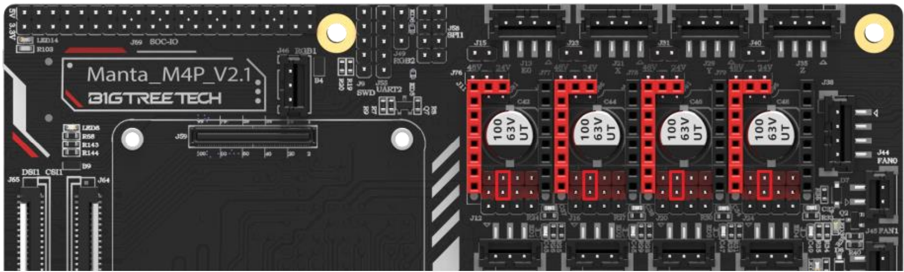
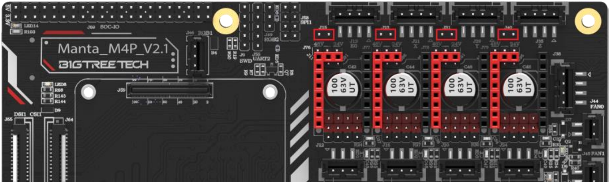
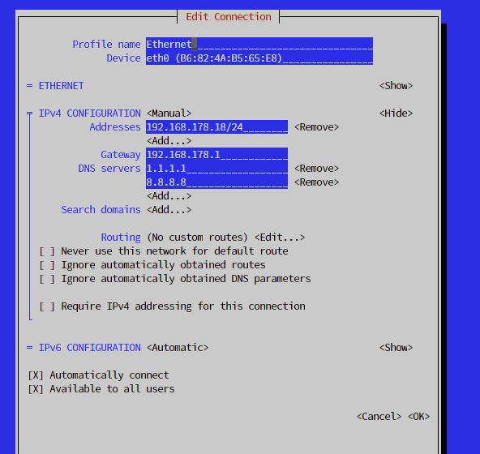

# BigTreeTech Manta M4P + CB1 - Sovol SV06 Plus Klipper Config

This repo contains my Sovol SV06 Plus config for use with Klipper.  
I have exchanged the stock mainboard with a Manta M4P from BigTreeTech and I am using the CB1 to control Klipper via Mainsail.  
The `printer.cfg` is attached. STL for the M4P case will follow (shortly).

I have modified the config found in [https://github.com/bassamanator/Sovol-SV06-firmware/tree/sv06-plus](https://github.com/bassamanator/Sovol-SV06-firmware/tree/sv06-plus)  
(You need to get the cfgs folder from his repository.)

## Contents

- [M4P Notes](#m4p-notes)
  - [Fans](#fans)
  - [Filament Sensor](#filament-sensor)
  - [Z Stepper Motors](#z-stepper-motors)
  - [Sensorless Homing](#sensorless-homing)
  - [Z Probe Connector](#z-probe-connector)
- [CB1 Notes](#cb1-notes)
  - [Static IP](#set-static-ip-on-cb1)

## M4P Notes

### Fans

The mainboard is pin compatible with all plugs that come on the stock Sovol SV06 Plus.  
Only the hotend cooling fan (not the part cooling fan) needs to be crimped to use an JST XH 2 Pin connector. The Manta M4P came with a bag of connectors. You do not need to purchase them.  

For my config:   
The hotend cooling fan is plugged in to FAN0 on the M4P. It will turn on when you increase the temperature of the extruder. **!!Definitely verify this!!**  
The part cooling fan is plugged in to FAN2A on the M4P. It will turn on based on your GCode file.

### Filament Sensor

There are 2 filament sensor wires in the stock mainboard. One routes to the installed filament sensor near the spool.  
The other one is an optional position and routes to the right side of the hotend. You only need to plug in the one you are using into the E0-Stop connector on the M4P.

### Z Stepper Motors

Since both Z stepper motors of the SV06 Plus are crimped into the same connector you can just plug them in to the connector labelled Z on the board.

### Sensorless homing

To use sensorless homing you need to configure the TMC2209 drivers to use UART.
Set the jumpers as follows:
  
(Mine came set from factory like this.)

Furthermore you need to set these additional jumpers:
  
(I have not set the Z jumper since it uses the probe for Z homing.)

### Z Probe Connector

The Z probe connector plugs right in since it is made to be compatible with BLTouch.  
The pin used is `PC14`.

## CB1 Notes

### Set static IP on CB1

To use a static IP on the CB1 simply run `nmtui`. It is a terminal user interface for NetworkManager (comes preinstalled with the BTT CB1 images). It should look like this:  
  
(Navigate the UI with the arrow keys and the TAB key.)